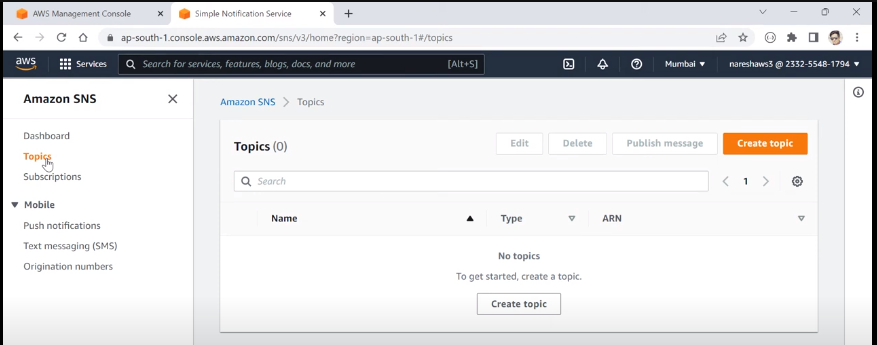

## aws

#### Small step towards AWS and cloud computing world

### sample application.properties file

accessKey=
secretKey=
region=ap-south-1
cloud.aws.region.static=ap-south-1
cloud.aws.region.auto=false
cloud.aws.stack.audo=false
spring.main.allow-bean-definition-overriding=true
logging.level.com.amazonaws.util.EC2MetadataUtils=error
logging.level.com.amazonaws.internal.InstanceMetadataServiceResourceFetcher=error

### run url thro' postman

GET http://localhost:8080/s3bucket/add/bucket
Bucket already exist with name:bucket

GET
http://localhost:8080/s3bucket/add/aws-mine-bucket
Bucket created with name:aws-mine-bucket
ERR Unable to create bucket :The AWS Access Key Id you provided does not exist in our records. (Service: Amazon S3; Status Code: 403; Error Code: InvalidAccessKeyId; Request ID: VVDZESB284X0Q5GG; S3 Extended Request ID: xxxx=; Proxy: null)
Unable to create bucket :The AWS Access Key Id you provided does not exist in our records. (Service: Amazon S3; Status Code: 403; Error Code: InvalidAccessKeyId; Request ID: XH5AH0NFWWVB49A7; S3 Extended Request ID: XCkjGwXR8IqAEYQdY6IWT6WDIdSTAPa7UOD+yIbxnsv28L+j9ZkL7Ib78PLgn5ceQW7fQotQNfg=; Proxy: null)

### SQS Simple Queue Service

1) Publish -> tell URL (sqs.url)
2) Consume -> tell QueueName
3) Microservice

When No IAM user roles for the logged in user

Giving permissions

@SqsListener -> made by Spring so dependency used is *spring-cloud-starter-aws-messaging*

### SNS Simple Notification Service

e.g. NewsLetter 

1) Topic -> create topic -> publish msg
2) Subscription -> Protocol [HTTP, Email, SMS, SQS, Lambda etc...]
3) 

Topic names can be multiple can be same can be same in another aws user account
So Topic ARN ->  

